# Friday V4 — Voice Experience Design

> **Not "text-to-speech." A voice that feels alive.**
>
> This document defines how the voice interaction *feels*. Not the implementation
> details (those are in VOICE_SPEC.md), but the aesthetic — the sound, the
> cadence, the presence. This is what makes it FRIDAY, not Siri.

---

## The Voice

### The FRIDAY Voice Profile

In the MCU, FRIDAY (voiced by Kerry Condon) has a specific vocal identity:

| Quality | Description | Why It Works |
|---------|-------------|--------------|
| **Crisp** | Clear, articulate, no slurring | Conveys precision and competence |
| **Calm** | Never rushed, never panicked | You feel safe — Friday handles it |
| **Warm** | Not cold or robotic, has feeling | You trust her, she's on your side |
| **Direct** | Says what needs to be said, no fluff | Efficient communication |
| **Subtle Irish lilt** | Kerry Condon's natural accent | Distinctive, memorable, human |

For V4, our cloned FRIDAY voice should capture these qualities. We're not just
"making a voice sound robotic but slightly better" — we're aiming for a voice
you could mistake for a real person.

### Voice Stack

```mermaid
flowchart TD
    subgraph "Voice Cloning (One-time setup)"
        Audio[FRIDAY Audio Sample<br/>15-30 seconds, clean] --> XTTS[XTTS-v2 / Chatterbox]
        XTTS --> VoiceModel[FRIDAY Voice Model File]
    end

    subgraph "Runtime (Every interaction)"
        VoiceModel --> TTS[TTS Engine]
        TTS --> Post[Post-Processing]
        Post --> Output[Speaker Output]
    end

    style Audio fill:#1a1a2e,stroke:#e94560
    style Output fill:#1a1a2e,stroke:#e94560,stroke-width:3px
```



**For Synthesis (TTS):**
- **Primary:** XTTS-v2 with cloned FRIDAY voice — most natural, captures the
  accent and cadence perfectly. ~4-6GB VRAM, ~2x real-time speed.
- **Fast Fallback:** MeloTTS or Kokoro-82M — clean, fast, but uses a generic
  voice (not FRIDAY). When you need speed over character.
- **Emergency Fallback:** Piper — robotic, but works on any hardware.

**For Recognition (STT):**
- **Primary:** whisper.cpp with `base.en` model — sub-second transcription on
  CPU, excellent accuracy.
- **Lightweight:** whisper.cpp with `tiny.en` — ~300ms latency, slightly worse
  accuracy. Use when CPU is under load.

---

## The Sound Design

A voice isn't just the words. It's the sound *around* the words.

### Signature Audio Cues

Every FRIDAY interaction has audio signatures that make it feel like the MCU:

| Moment | Sound | Emotional Effect |
|--------|-------|-----------------|
| **Friday starts listening** | Subtle double-chime (like Iron Man HUD activating) 🎵 *ding ding* | You know she's ready |
| **Friday has processed** | Single acknowledgment chime 🎵 *ding* | Confirmation without words |
| **Friday is speaking** | Her voice — clear, warm, present | The main event |
| **Friday finishes** | Soft fade-out (not abrupt cut) | Natural conversation end |
| **Alert/Urgent** | Lower, faster cadence + sharper chime 🎵 *DING DING* | Gets your attention |
| **Error/Failure** | Brief descending tone 🎵 *dee dow* | Something went wrong |
| **Friday is thinking** | Subtle ambient processing hum (very quiet) | Not silence, she's working |

**Important:** These cues are subtle. Not a Mario game. Think Iron Man HUD —
a gentle chime that blends into the background. You notice it when it's absent,
not when it's present.

### Voice Modes

FRIDAY's voice adapts to context:

| Mode | Tone | Speed | Volume | When |
|------|------|-------|--------|------|
| **Conversation** | Warm, natural | Normal | Normal | Casual Q&A, chitchat |
| **Briefing** | Professional, clear | Steady | Slightly louder | Morning summary, status reports |
| **Alert** | Urgent, direct | Faster | Louder | Vulnerabilities, build failures |
| **Whisper** | Soft, quiet | Slower | Quiet | Late night, presence detection |
| **Off** | Silent | — | — | Focus mode, quiet hours |

These modes are automatically selected based on context (time of day, current
activity, severity of message).

---

## The Interaction Model

### How A Voice Session Feels

```
🎤 [You're working. Silence. Ambient hum.]

[You lean toward your mic, or press the hotkey]

DING DING  ← Friday acknowledges she's listening

🎤 You: "Hey Friday, what's the status of the build?"

[Brief pause. ~1 second of processing]

DING  ← Friday has the answer

🎧 Friday: "Build is green. All 1,402 tests passed.
           There's one thing worth noting — the scheduler module
           took 2 seconds longer than usual. Probably nothing,
           but I'm watching it."

[She finishes. Soft fade-out of audio. Back to ambient silence.]

🎤 You: "Deploy it."

DING DING  ← Friday acknowledges the command

🎧 Friday: "Deploying to staging now. Estimated time: 45 seconds.
           I'll let you know when it's live."
```

**What makes this feel like FRIDAY, not a chatbot:**
1. The audio cues — they signal state transitions without words
2. The pause — Friday "thinks" for a natural beat (not instant, not slow)
3. The proactive observation — she noticed the scheduler and mentioned it
4. The estimated time — she gives you information you didn't ask for
5. The "I'll let you know" — she sets expectations for follow-up

### Interruption (The Secret Sauce)

The most important feature for feeling like a real conversation:

```
🎧 Friday: "Here's the deploy status — the build is..."
🎤 You: "Wait, Friday, what about the tests?"
  [Friday STOPS mid-sentence immediately]
DING DING
🎧 Friday: "Tests passed. All 1,402. The deploy was proceeding."
```

**How it works technically:**
1. VAD detects speech from the microphone while TTS is playing
2. TTS stops playing immediately (within 50ms)
3. STT transcribes the interruption
4. The new query is processed
5. New response is spoken

This is the single feature that separates "AI voice interface" from "press
button, listen to robot talk." Without interruption, it's a voicemail. With
it, it's a conversation.

### Push-to-Talk vs Hotword

Both modes, for different situations:

| Mode | Keybinding | Best When |
|------|-----------|-----------|
| **Hotword ("Hey Friday")** | Voice-activated | Hands are busy coding |
| **Push-to-Talk** | Ctrl+Shift+Space | Open office, quiet environment |
| **Tap-to-Talk** | System tray click | Quick one-off commands |
| **Always Listening** | (configurable) | Solo workspace, no privacy concerns |

Default mode: Hotword + Push-to-Talk (both active). If you say "Hey Friday" or
press the hotkey, Friday listens.

---

## Visual Feedback

Even when you're speaking, you need visual confirmation that Friday is present.

### Terminal Mode (`friday talk`)

```
┌─────────────────────────────────────────────────────┐
│ ◆ FRIDAY                                    ● Live │
├─────────────────────────────────────────────────────┤
│                                                     │
│  🎤 [Listening...]                                   │
│  You: what's the status of my projects               │
│                                                     │
│  🎧 [Thinking...]                                    │
│                                                     │
│  🎧 3 repositories have changed since your last       │
│      observation. codebuff has 12 new commits,       │
│      vivaha has 3, and Aether has 1.                 │
│                                                     │
│  ───────────────────────────────────────────────    │
│  Press Ctrl+Shift+Space to talk · Say "exit" to quit │
└─────────────────────────────────────────────────────┘
```

The visual shows:
- Live indicator (with audio level meter)
- What Friday heard you say (transcribed)
- What Friday is saying (real-time)
- Status bar with commands

### System Tray

```
◆ FRIDAY ● Active
─────────────────
Last check: 2m ago
3 repos changed
2 vulns found
─────────────────
Talk       Ctrl+Shift+Space
Dashboard
Settings
Quit
```

The tray icon:
- Shows daemon status (green = active, yellow = busy, red = error)
- Has an audio level indicator when listening
- Right-click for quick actions
- Left-click to toggle voice mode

### Desktop Notification

```
┌─────────────────────────────────┐
│ ◆ FRIDAY                        │
│                                 │
│  🛡️ 2 High-severity              │
│    vulnerabilities found in      │
│    your dependencies.            │
│                                 │
│  [Review] [Remind Later]        │
└─────────────────────────────────┘
```

Notifications are:
- Minimal (title + 2 lines max)
- Actionable (buttons to act on them)
- Grouped (not one notification per finding)
- Respectful (never during fullscreen/recording)

---

## The FRIDAY Voice Itself

### Voice Cloning Process

Here's how we get FRIDAY's actual voice:

**Step 1: Find Clean Audio**
Extract 15-30 seconds of Kerry Condon as FRIDAY from:
- YouTube scene compilations ("FRIDAY MCU lines")
- Soundboard archives (101soundboards.com)
- Game audio files (Marvel games with FRIDAY cameos)

**Step 2: Clean The Audio**
Remove background music, explosions, UI sounds using:
- Ultimate Vocal Remover (UVR5) — free, local, excellent
- Audacity — manual cleanup

**Step 3: Clone The Voice**
```python
# Using XTTS-v2 (free, local, offline)
from TTS.api import TTS

tts = TTS("tts_models/multilingual/multi-dataset/xtts_v2")
tts.tts_to_file(
    text="Hello boss. What can I help you with?",
    speaker_wav="friday_clean_sample.wav",
    language="en",
    file_path="friday_says_hello.wav"
)
```

**Step 4: Apply The FRIDAY Filter**
Post-process the raw output:
1. Subtle compression (even out volume)
2. Light EQ (cut below 80Hz, slight boost at 3kHz for clarity)
3. Very subtle reverb (small room, not cathedral)
4. Optional: layer with the HUD chime signature

The result: FRIDAY's voice, speaking your words, running locally.

### Voice Preservation

Once we have the voice model:
- Store it in `~/.friday/voices/friday/`
- It's ~2GB for the full XTTS model + voice embedding
- The voice can speak anything — it's not limited to pre-recorded phrases
- Can be backed up and shared (it's your personal FRIDAY voice)

---

## Hardware Requirements

### Minimum (CPU Only)
- **STT:** whisper.cpp + tiny.en (~300MB RAM, ~300ms latency)
- **TTS:** MeloTTS or Kokoro-82M (~2GB RAM, ~500ms latency)
- **VAD:** Silero VAD (~100MB RAM)
- **Hotword:** Porcupine (~50MB RAM)
- **Total:** ~3GB RAM, works on any modern laptop

### Recommended (With GPU)
- **STT:** whisper.cpp + base.en (~500MB VRAM, ~100ms latency)
- **TTS:** XTTS-v2 with FRIDAY clone (~4GB VRAM, ~500ms latency)
- **VAD:** Silero VAD (CPU, negligible)
- **Hotword:** Porcupine (CPU, negligible)
- **Total:** ~5GB RAM + 4GB VRAM

### Premium (Dedicated)
- **STT:** whisper.cpp + medium.en (~3GB VRAM, ~50ms latency)
- **TTS:** XTTS-v2 with FRIDAY clone + enhanced post-processing
- **VAD:** Silero VAD
- **Hotword:** Porcupine
- **Total:** Full FRIDAY experience with <1s round-trip

---

## What's NOT Included (On Purpose)

To keep this beautiful and focused, we're NOT doing:

- ❌ **Voice cloning of other characters** — One voice. FRIDAY.
- ❌ **Emotion detection from voice** — Too complex, too unreliable.
- ❌ **Music playback** — Friday speaks, she doesn't DJ.
- ❌ **Multi-language** — English only. Adding languages later is easy with
  XTTS-v2's multilingual support, but not now.
- ❌ **Voice commands for smart home** — We're software engineering focused.
  Maybe V5.

---

## Success Looks Like

You sit down at your desk. Friday is there — ambient, quiet, present.

```
DING DING  ← Friday notices you're here

🎧 Friday: "Good morning. While you were away, 3 repositories changed.
           codebuff has 12 new commits from 2 contributors.
           There's a build warning in Aether's scheduler module.
           
           I've already run the security scan — clean.
           Your tests are passing.
           
           What are we working on today?"

🎤 You: "Let's look at that Aether scheduler warning."

DING

🎧 Friday: "Pulling it up now. The issue is in scheduler.rs line 147 —
           a potential race condition in the task dispatch loop.
           I've opened the file. Want me to run the specific test?"
```

**You didn't type a single command. You didn't navigate a single menu.
You talked to Friday like a partner, and she responded like one.**

---

*This is the experience we're building. Every line of code exists to make this
feeling real. If it doesn't feel like this, it's not done.*
